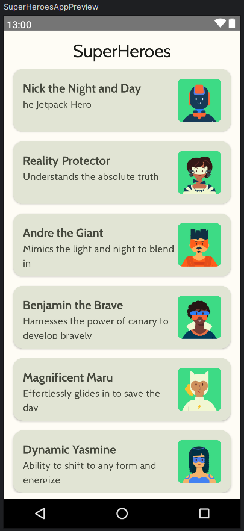
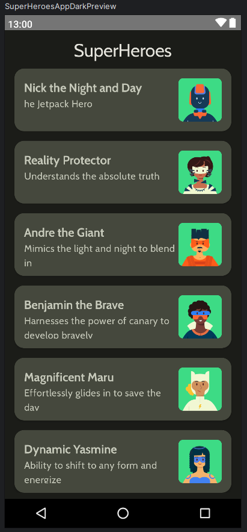

# SuperHeroes App

Android app of SuperHeroes developed using kotlin and Jetpack Compose library.

## Tech Stack

- Android
- Jetpack Compose

## Features

- Material UI 3 (Typography, Shapes, Colors)
- Theming (Ligth/Dark)
- Scaffold Composable (Top app bar)
- LazyColum Composable
- String, dimensions, drawable resources
- Adaptively Launch Icon App

## App gallery

### Light Theme

### Dark theme

